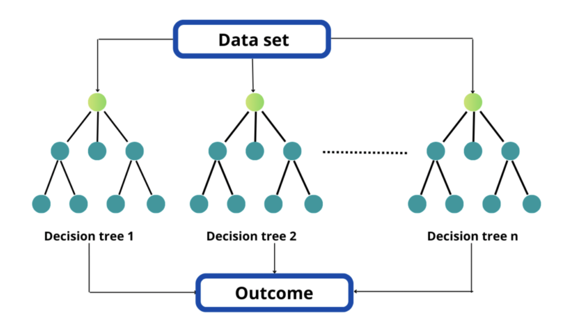

# Passive Investing Financial Analysis & Predictive Modelling

### Technical Description in Non-Technical Terms
This project’s goal is motivate individuals to passively invest in index funds or exchange traded funds (ETFs) for long-term / low-fee monetary growth that comes with a low-level of risk. The purpose of the finacial analyses (built with basic statistical techniques implemented with Python 3 - programming language) & the prediction models (complex machine learning algorithms that use Python 3 as well) provided as 'Notebooks' on this repository (web page) is to mathematically & statistically prove that the index funds (investment vehicles) have the tendency to increase in value or price with respect to time. In simple terms, the analyses and machine learning models support the hypothesis that passive investing (responsibly and strategically) will benefit individual's financial well being. In addition, these models were 'fed' with historical stock / ETF / Index Fund price data extracted or downloaded from the official Yahoo Finance website. Note that there are hundreds of funds currently available in the U.S. Stock Market - however, this project only includes the top 4 index funds or ETFs by asset size (Assets Under Management - AUM) from Morningstar categories (Large Blend, Large Value & Large Growth).

<b>Click the following link to see PowerPoint Presentation Summary (PDF format):</b> https://github.com/Juan-Moctezuma/Passive_Investing_Analysis_-_Predictive_Modelling/blob/main/Analysis_%26_Prediction_Summary.pdf

### Jupyter Notebook Links
The following bullet points list the Jupyter Notebooks containing the Python code with splitted steps, details that are not included in the powerpoint presentation, and comments:  
* <b>Notebook 1 - Large Blend Financial Analysis</b> : https://github.com/Juan-Moctezuma/Passive_Investing_Analysis_-_Predictive_Modelling/blob/main/Part1-Large_Blend_Fund_Category-Financial_Analysis.ipynb
* <b>Notebook 2 - Large Value Financial Analysis</b> : https://github.com/Juan-Moctezuma/Passive_Investing_Analysis_-_Predictive_Modelling/blob/main/Part2-Large_Value_Fund_Category-Financial_Analysis.ipynb
* <b>Notebook 3 - Large Growth Financial Analysis</b> : https://github.com/Juan-Moctezuma/Passive_Investing_Analysis_-_Predictive_Modelling/blob/main/Part3-Large_Growth_Fund_Category-Financial_Analysis.ipynb
* <b>Notebook 4 - Large Blend Prediction Model (Random Forest Classifier)</b> : https://github.com/Juan-Moctezuma/Passive_Investing_Analysis_-_Predictive_Modelling/blob/main/Part4-Large_Blend_Fund_Category-Prediction_Random_Forest_Classifier_Model.ipynb
* <b>Notebook 5 - Large Value Prediction Model (Random Forest Classifier)</b> : https://github.com/Juan-Moctezuma/Passive_Investing_Analysis_-_Predictive_Modelling/blob/main/Part5-Large_Value_Fund_Category-Prediction_Random_Forest_Classifier_Model.ipynb
* <b>Notebook 6 - Large Growth Prediction Model (Random Forest Classifier)</b> : https://github.com/Juan-Moctezuma/Passive_Investing_Analysis_-_Predictive_Modelling/blob/main/Part6-Large_Growth_Fund_Category-Prediction_Random_Forest_Classifier_Model.ipynb
* <b>Notebook 7 - Large Blend Prediction Model (Simple Linear Regression)</b> : https://github.com/Juan-Moctezuma/Passive_Investing_Analysis_-_Predictive_Modelling/blob/main/Part7-Large_Blend_Fund_Category-Prediction_Linear_Regression_Model.ipynb
* <b>Notebook 8 - Large Value Prediction Model (Simple Linear Regression)</b> : https://github.com/Juan-Moctezuma/Passive_Investing_Analysis_-_Predictive_Modelling/blob/main/Part8-Large_Value_Fund_Category-Prediction_Linear_Regression_Model.ipynb
* <b>Notebook 9 - Large Growth Prediction Model (Simple Linear Regression)</b> : https://github.com/Juan-Moctezuma/Passive_Investing_Analysis_-_Predictive_Modelling/blob/main/Part9-Large_Growth_Fund_Category-Prediction_Linear_Regression_Model.ipynb

### Machine Learning (M.L.) Models
1. Random Forest Classifier - M.L. method for classification, regression and other tasks that operate by constructing a multitude of decision trees at training time. Then when it comes to testing, it will try to perform a similar action. For classification tasks, the output of the random forest is the class selected by most trees. Therefore, the output of multiple decision trees reach a single result - in this case the output is the probability for share prices to increment in the future based on historical data patterns raging from 1 or 2 decades ago. 
2. Simple Linear Regression - M.L. method that provides a linear relationship between an independent variable and a dependent variable to predict the outcome of future events. model predicts the value of the dependent variable, which is the response or outcome variable being analyzed or studied & simulates a mathematical relationship between variables and makes predictions for continuous or numeric variables such as sales, salary, age, product price, etc. In this case, our prediction is based on the following question - Will share prices continue to increase on the long run? 

